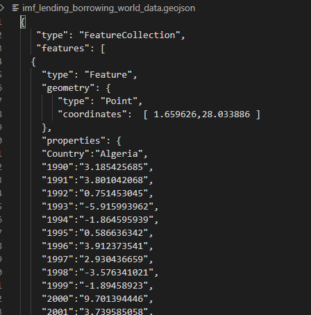
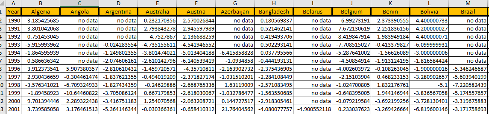
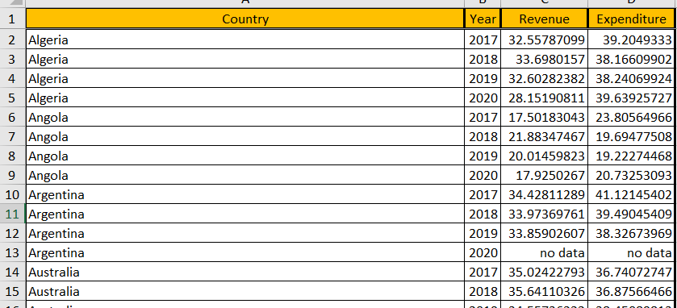
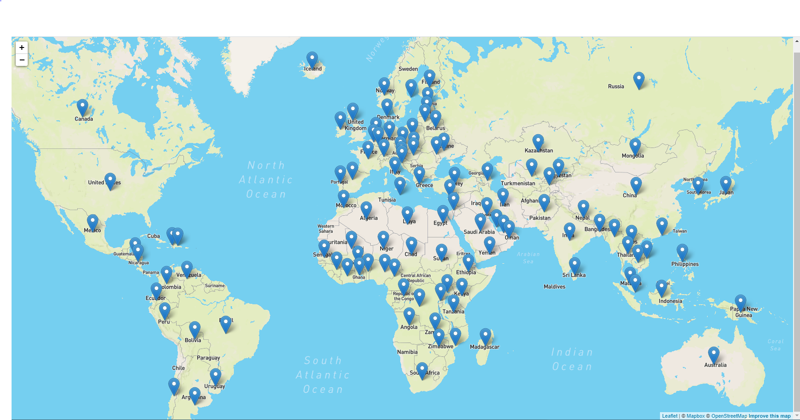

# world_indebtedness_group_g

# World Indebtedness Group

## Group G 
Erik Fritzsche
Sirine Khelifi
Beverly Thompson

# Overview
This project explores data from the International Monitary Fund that includes expenditures, revenues and a combination of the two for countries throughout the years.   This project is exploring specifically the data from years 2017 - 2020.

The data is explored utilzing Python, Flask, Pandas, MongoDB Atlas, HTML, CSS and Javascript.
# Data
Our data for this project was sourced from the International Monetary Fund (IMF; https://www.imf.org/external/datamapper/GGXCNL_G01_GDP_PT@FM/ADVEC/FM_EMG). In order to utilize the data a MongoDB Atlas database was setup. We were successful and getting our data loaded to the database, but we were not able to read any data from the different collections within the database. Therefore, we each used a csv file to create the datasets that we would use for our visuals. 
Each of the visuals utilizes a different data file as the data needed to be in different formats.
* The world map uses a geoJSON object which was created from two different files; a .csv of the indebtedness data and a .csv of latitude/longitude in order to be able to place markers on the visual.

* The line chart took the original IMF data and was transposed which put the year data as the rows and the country data as the columns. This transposition provided a clean set of data that could be used for making a line chart.

* The scatter plot data came from two different source files; one for revenue and one for expenditures. These two files were merged on country and the data was rearranged to provide a clean data set.

# Views
## World Indebtedness Map
This view shows a world map showing the Net lending/borrowing value for each country. The indebtedness values appear in tooltips when the user hovers over a marker. The user would also have the option to change the data points that show in the tooltips to view values from specific years (2017 through 2020).

## World Indebtedness Line Chart
This view shows an interactive line chart with multiple Y Axis points.   A chart can be created for the following:
* Advanced Economy Countries

The Advanced Economies chart shows a very dramatic shift downward at about the time of Covid-19 shutdown time.  And that does make sense since so much of the advanced structure of these economies shut down completely for a while.   And even those businesses that stayed open did less business because most people stayed away from crowds when possible.
* Emerging Market Countries

The Emerging Markets chart had some downturn but bit as much as the Advanced Economy  Countries.  For this chart there are two countries (Venezuela 2019=-5.15, Argentina-2019=-31) that did not have any data at all for 2020 which was set to 0.   Therefore using 0 for this value will give them a better situation for 2020 than is most likely the reality. Additionally, Libya with 2.19 in 2019 had -102.9 in 2020.    That will also greatly impact to totals form the Emerging Markets.
* Low-Income countries

Low Income countries had some countries that took a downturn but also a lot that did not seem to be heavily impacted.  
* A grouping of all of the three categories together each as an individual line.

The high-level group chart is in line with each individual chart.  That is at the 2020 point, the Low-Income countries are in the best situation, the Emerging Markets are second and the Advanced Economies are by far in the worst situation in terms of indebtedness.  And this makes sense because there was more structure to break when Covid-19 hit in 3/2020.   Some of this might also be due to the differences that occurred from the government response.   A lot of the advanced economies attempted to provide assistance for their citizens.  This would thus cause more debt. This might not be the case for countries in the emerging and low-income countries.

## Revenue Expenditure Scatter Plot
This view shows a scatter plot with one axis being Expenditure  as a % of GDP and one axis being Revenue also as % of GDP. Toggle buttons were created to switch between the years 2017-2020. 

The pandemic of 2020 has effected the world's economy and the scatter plot shows the trend of the world's economy by looking at Expenditure and Revenue as % of GDP. 2020 shows that all countries' Expenditure increased vs the Revenue leading to an increased Debt. 

The advanced economies showed a larger dip in debt compared to 'low-income' and 'low-income and emerging economies'. 

