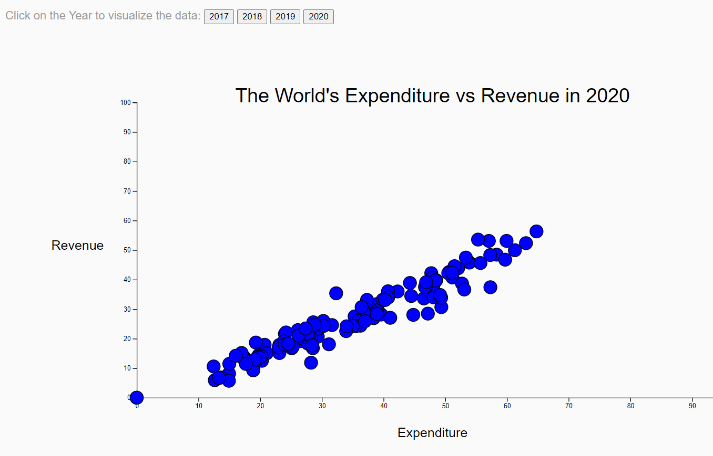

# world_indebtedness_group_g

# World Indebtedness Group

## Group G 
Erik Fritzsche
Sirine Khelifi
Beverly Thompson

# Overview
This project explores data from the International Monitary Fund that includes expenditures, revenues and a combination of the two for countries throughout the years.   This project is exploring specifically the data from years 2017 - 2020.

The data is explored utilzing Python, Flask, Pandas, MongoDB Atlas, HTML, CSS and Javascript.

# Views
## World Indebtedness Map
This view shows a world map showing the Net lending/borrowing value for each country.
## World Indebtedness Line Chart
This view shows an interactive line chart with multiple Y Axis points.   A chart can be created for the following:
* Advanced Economy Countries

* Emerging Market Countries

* Low-Income countries

* A grouping of all of the three categories together each as an individual line.

## Revenue Expenditure Scatter Plot
This view shows a scatter plot with one axis being Expenditure  as a % of GDP and one axis being Revenue also as % of GDP. Toggle buttons were created to switch between the years 2017-2020. 

