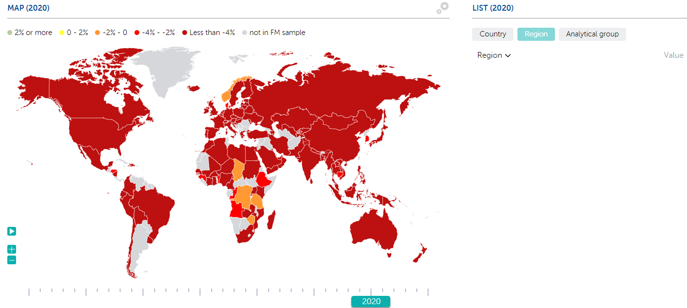

An Analysis of World Indebtedness - 2017 to 2020

Group Members:
Sirine Khelifi
Beverly Thompson
Erik Fritzsche

Summary:
In this project we will be looking at comparing countries indebtedness beginning in 2017 and going through 2020. This analysis allows us to gain a global perspective on the financial effects the pandemic had on the world. The idea that the pandemic had disastrous financial drawbacks is widely perceived by many across the world. However, looking at data visualization can shed more light into it.

The data set chosen from the IMF website looks at the indicator: Net Lending/borrowing also referred to as overall balance (% of GDP).

Our data is structed as follows:
* A column that contains the name of a country (stored as strings)
* Columns that contains the year of the data for each country. The year columns start with 1990 and go through 2020.
Here is a screen shot of the metadata.
    

Here is a screen shot of a sample of the data we will be working with.
    

The world map will be highlighting the overall balance ratio for each country using color codes. While each country will display on its own, each country will also be included in a specific category. These categories are:
1. Advanced Economies
2. Emerging and Middle Income
3. Low Income Developing

The visualizations we plan to display are:
1. A world map that shows the percent of indebtedness (in a color) for each country by year. The end user can select which year they want to view on the map (2017, 2018, 2019, or 2020).
    This map might look like this.
    

2. A line chart that shows the percent of indeptedness for each country from 2017 to 2020. This line chart will correspond with the data that is displaying on the map. For example, if the end user chooses to view the Advanced Economies on the map, the chart will also display data for the Advanced Economies.
    This chart might look like this.
    

3. A bubble chart that displays the Revenue and Expenditure for each country by year from 2017 to 2020.
    This chart might look like this.
    

Here is a link to the GitHub repository we will be using: https://github.com/Efritch/world_indebtedness_group_g.git

